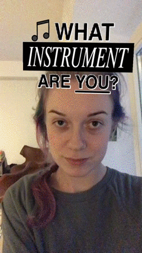

# What are you? Filter

📷 A randomized roulette-style face effect template for Spark AR.

## Notes

- Uses the common texture flipbook mechanic (`You are XYZ`)
- Also includes optional sounds, particle effects and face mask that activate when the result is set, see `face effects (optional)` object
- Built in Spark AR Studio v78.1.0.18.234

- - -

Instagram filter link tba. – [@zerstoerer](https://instagram.com/zerstoerer).
Face mask textures and particle effects from [OpenMoji](https://openmoji.org/).
